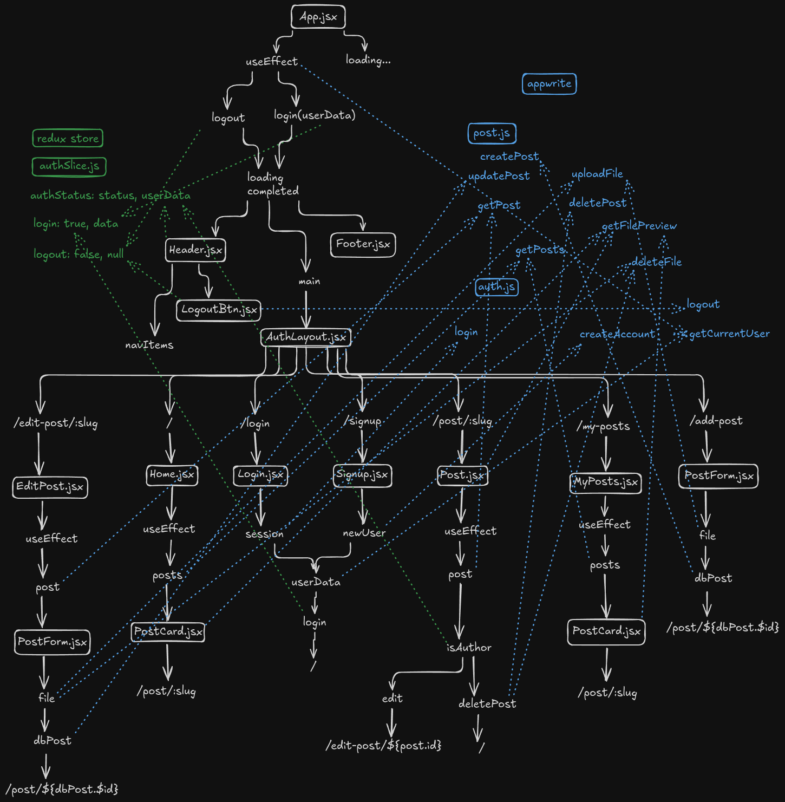

# Info Cluster

A full-fledged blog application implemented with industry level practices!

## features

- Users can also hide their blogs whenever they wish as well as unhide them.

## Installation

### Prerequisites

- Node.js
- Appwrite Developer Account
- TinyMCE Developer Account

### Steps

Provide step-by-step instructions to get the development environment running.

1. Clone the repository:
   ```bash
   git clone https://github.com/awaizdottech/infoCluster
   ```
2. Navigate into the project directory:
   ```bash
   cd infoCluster
   ```
3. Install dependencies:
   ```bash
   npm install
   ```
4. Set up all necessary environment variables:
   ```bash
   cp .env.sample .env
   ```
5. Run the project locally:
   ```bash
   npm run dev
   ```

## Simplified Overview / Architecture



## Future Plans

- image compression, security etc also available for images in appwrite
- account delete option, acc post delete or keep

mobile friendly
editor mentioned in posts
post redux slice
fixed image size & skeleton for images
docker
limiting the loading animation then displaying error info
proper loading of blogs when visited by direct blog links
